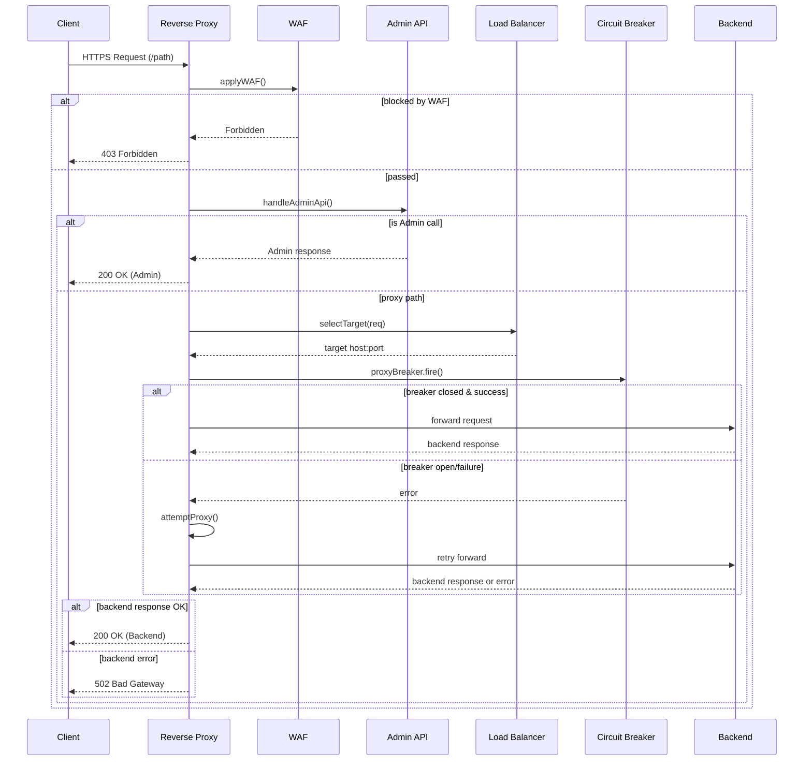

# Reverse Proxy App

A dynamic, TypeScript-based reverse proxy with health checks, load balancing, sticky sessions, admin API, metrics, and alerting.

## Table of Contents

- [Functional Aspect](#functional-aspect)
- [Technical Aspect](#technical-aspect)
- [Architectural Aspect](#architectural-aspect)
- [Getting Started](#getting-started)
- [Usage Examples](#usage-examples)
- [Configuration](#configuration)
- [Docker & Compose](#docker--compose)
- [Automated Testing](#automated-testing)
- [Contributing](#contributing)
- [License](#license)

## Functional Aspect

This section describes what the proxy does from an end-user or operator perspective:
- **Health Checks & Failover**  
  Monitors registered backend servers on `/health` endpoint and automatically removes or reinstates them based on status.
- **Load Balancing**  
  Distributes incoming traffic across healthy backends using configurable sticky session strategies (IP hashing or cookie-based).
- **Admin API**  
  Secure, pluggable endpoints to change proxy behavior at runtime:
    - `GET    /admin/waf/rules`         → List current WAF rule patterns.
    - `POST   /admin/waf/rules`         → Add a new WAF rule (hot‑reloaded on save).
    - `DELETE /admin/waf/rules`         → Remove an existing WAF rule.
    - `POST   /admin/sticky-mode`       → Switch between `ip-hash` and `cookie` modes.
    - `POST   /admin/server/register`   → Add a backend.
    - `POST   /admin/server/deregister` → Remove a backend.
- **Metrics & Monitoring**  
  Exposes Prometheus‑style metrics at `/metrics` for request counts, active requests, queued requests, and average response time.
- **Alerting**  
  Sends email alerts when backends go down or recover.

## Technical Aspect

Details about implementation and technologies used:
- **Language & Runtime**
    - TypeScript, Node.js (LTS)
- **Core Modules**
    - `http-proxy` for proxying HTTP and WebSocket traffic
    - `nodemailer` for SMTP email alerts
    - `dotenv` for environment-based configuration
    - `pino` for structured, colorized logging (via `pino-pretty`)
    - `zod` for runtime environment validation
    - `@sendgrid/mail` for HTTP‐based email alerts (replacing SMTP)
    - `prom-client` for Prometheus metric collection with correct Content-Type
    - `chokidar` for file‑watching and zero‑downtime hot‑reload of WAF rules.
    - Modular Admin API using the Open/Closed Principle (pluggable AdminRoute classes).
- **Process Management**
    - PM2 in cluster mode for zero‑downtime restarts and multi-core utilization
    - Dockerfile (multi-stage) for container builds
    - `docker-compose.yml` for full-stack local development (proxy, backends, MailHog, Prometheus, Grafana)
- **Testing & Development**
    - `ts-node-dev` for hot reload during development
    - **Unit/Integration:** Jest (`__tests__/*.test.ts`), including a dedicated `jest.integration.config.js` and `test/setupEnv.ts` for bootstrapping integration tests on ephemeral ports.
    - End-to-end smoke tests via shell scripts (`scripts/*.sh`)
    - Setup file for Jest (`test/setupEnv.ts`) to bootstrap environment variables
- **Build & Deployment**
    - `tsc` for compilation
    - Dockerfile (to be added) for containerization
- **Resilience & Reliability**
    - Connection timeouts on backend requests (5s proxyTimeout, 10s socket inactivity timeout)
    - Automatic retries with exponential backoff (2 retry attempts with exponential delays)
    - Circuit-breaker mechanism using `opossum` for fast-fail and backend recovery

## Architectural Aspect

High-level design and flow:
```text
        ┌─────────────┐
        │   Client    │
        └──────┬──────┘
               ↓
   ┌──────────────────────────────────────────────────┐
   │              HTTPS Reverse Proxy                │
   │  • TLS termination & ACME support               │
   │  • Load balancing (IP-hash / cookie)            │
   │  • Web Application Firewall (hot-reloaded)      │
   │  • Health checks, retries & circuit breaker     │
   │  • Admin API & dynamic backend discovery        │
   │  • Metrics endpoint & alerting integration      │
   └───────────────┬───────────────┬────────────────┘
                   │               │
         ┌─────────┘               └─────────┐
         ↓                                 ↓
   ┌──────────────┐                 ┌──────────────┐
   │  Backend 1   │  ...  Backend N │  Third-Party │
   │  (microservices)│              │  Services    │
   └──────────────┘                 └──────────────┘

   **External Systems**  
   - Prometheus (scrapes `/metrics`)  
   - Grafana (dashboard & alerting)  
   - MailHog / Email Service (alerts)  
```

- **Dynamic Discovery**: Backends can be registered/deregistered at runtime.
- **Health Monitoring**: Periodic health pings ensure traffic is only routed to healthy nodes.
- **Prometheus Integration**: Metrics endpoint for monitoring systems.
- **Alerting**: Email notifications for critical events.

## Low-Level Design

### 1. Folder & Module Layout

```text
src/
├── index.ts               # Entry point: parses env, wires up servers
├── proxy.ts               # Server startup, start/stop exports
├── config/
│   └── settings.ts        # Zod-validated environment schema
├── handlers/
│   ├── requestHandler.ts  # Main HTTP request dispatch (WAF, admin, proxy)
│   ├── upgradeHandler.ts  # WebSocket upgrade handling
│   ├── waf.ts             # WAF loader + chokidar watcher + applyWAF()
│   └── adminApi.ts        # Admin dispatcher using pluggable AdminRoute classes
├── handlers/adminRoutes/  # AdminRoute implementations
│   ├── adminRoute.ts
│   ├── GetWafRulesRoute.ts
│   ├── AddWafRuleRoute.ts
│   ├── DeleteWafRuleRoute.ts
│   ├── StickyModeRoute.ts
│   ├── RegisterServerRoute.ts
│   └── DeregisterServerRoute.ts
├── routing/
│   └── selector.ts        # IP-hash & cookie sticky logic
├── resilience/
│   └── breaker.ts         # Circuit breaker and retry logic
├── healthChecker.ts       # Periodic health pings and healthyServers list
├── websocketHandler.ts    # Shared WS upgrade logic
└── logger.ts              # Pino-configured logger
```

### 2. Request Flow Sequence

1. **Client** → HTTPS Reverse Proxy  
2. **Liveness**: `/healthz` → `200 OK`  
3. **WAF**: `applyWAF` checks hot‑reloaded rules → `403` or pass  
4. **Admin API**: `/admin/*` routed via AdminRoute plugins → feature handlers  
5. **Load-Balancing**: `selectTarget` picks from `healthyServers` (IP‑hash/cookie)  
6. **Resilience**: `proxyBreaker.fire(...)` (circuit breaker) → fallback `attemptProxy`  
7. **Proxy**: forward to `http://backend` or `502 Bad Gateway`  
8. **Metrics**: update Prometheus counters, available at `/metrics`  
9. **Alerting**: `healthChecker` sends email via SendGrid on state changes  


### 3. Sequence Diagram (Textual)

```text
Client -> Proxy: HTTPS GET /
Proxy -> WAF: apply regex rules
alt blocked
  Proxy -> Client: 403 Forbidden
else allowed
  Proxy -> AdminApi: matches? (no)
  Proxy -> LoadBalancer: selectTarget(req)
  Proxy -> CircuitBreaker: fire(proxy.web)
  alt success
    Proxy -> Backend: forward request
    Backend --> Proxy: 200 OK
    Proxy --> Client: 200 OK
  else failure
    Proxy -> Retry: attemptProxy(req, res)
  end
end
```

## Request-Response Flow Diagram

Below is a **Mermaid** sequence diagram illustrating the full request-response path through the proxy:


       
### Sequence diagram
<!-- or with an HTML  for sizing control: -->


## Getting Started

### Prerequisites

- Node.js (v16+ recommended)
- npm
- OpenSSL (for self‑signed cert generation)

### Installation

```bash
git clone <repo-url>
cd reverse-proxy-app
npm install
chmod +x scripts/generateCert.sh
./scripts/generateCert.sh
```

<!-- If using ACME with a real domain, run: -->
<!--
export USE_ACME=true
export DOMAIN=your.domain.com
export WEBROOT=/path/to/webroot
chmod +x scripts/generateCert.sh
./scripts/generateCert.sh
-->

### Running in Development

```bash
npm run dev
```

### Running in Production

```bash
npm run build
pm2 start pm2.config.js
```

## Usage Examples

- **Test proxy**
  ```bash
  curl -k https://localhost:8443/
  ```

- **Change sticky mode**
  ```bash
  curl -k -u adminuser:securepassword \
       -X POST https://localhost:8443/admin/sticky-mode \
       -H "Content-Type: application/json" \
       -d '{"mode":"cookie"}'
  ```

- **Register a backend**
  ```bash
  curl -k -u adminuser:securepassword \
       -X POST https://localhost:8443/admin/server/register \
       -H "Content-Type: application/json" \
       -d '{"host":"localhost","port":3004}'
  ```

## Configuration

All settings are controlled via environment variables. See `.env.example` for details.

## Docker & Compose

A one‑command local stack for development:

```bash
docker compose up --build
```

This brings up:
- Reverse proxy on ports 8080 (HTTP) and 8443 (HTTPS)
- Three dummy backends (ports 3001–3003)
- MailHog (SMTP/UI)
- Prometheus on port 9090 (scraping `/metrics` with `fallback_scrape_protocol: http`)
- Grafana on port 3000

## Automated Testing

The repository includes automated test suites:

- **Unit/Integration:** Jest (`__tests__/*.test.ts`), mocking `sendAlert` and using `checkServerHealth()`
- **End-to-End:** `scripts/*.sh` for IP-hash, cookie, dynamic backend, and observability checks
- **Prometheus/Grafana checks:** Scripts under `scripts/` can verify target health and dashboard config
- **Integration Tests:** `npm run test:i` uses `jest.integration.config.js` to spin up the proxy on random ports and validate end-to-end behavior (IP-hash, cookie sessions, dynamic backends, WAF).

## Contributing

PRs and issues are welcome! Please follow the existing code style and add tests for new features.

## License

MIT License
